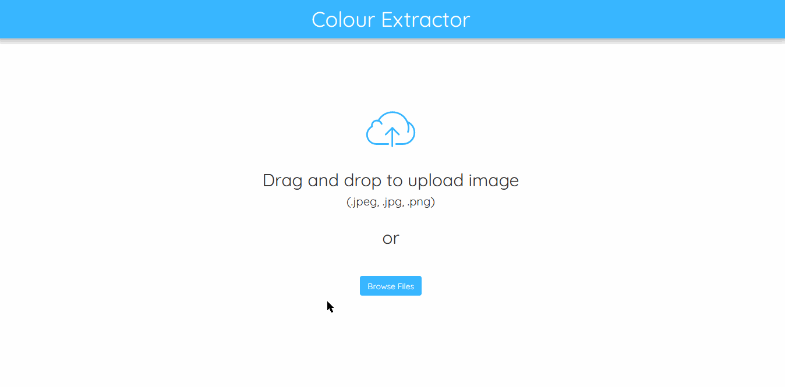

A website that finds the most common colors in an uploaded image.

Try it out here [now](https://image-color-palette-app.herokuapp.com/).

# How it works:

# Features:
- Upload an image file.
- Extract the most common colors in an uploaded image.
- Copy the extracted color to the clipboard.
