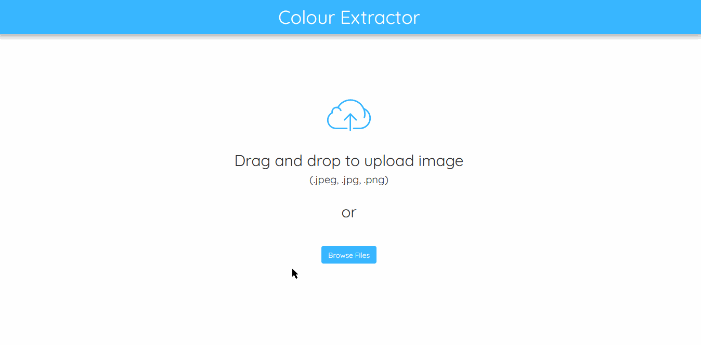
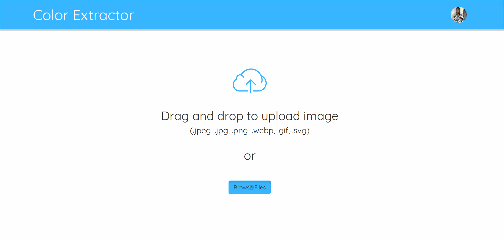
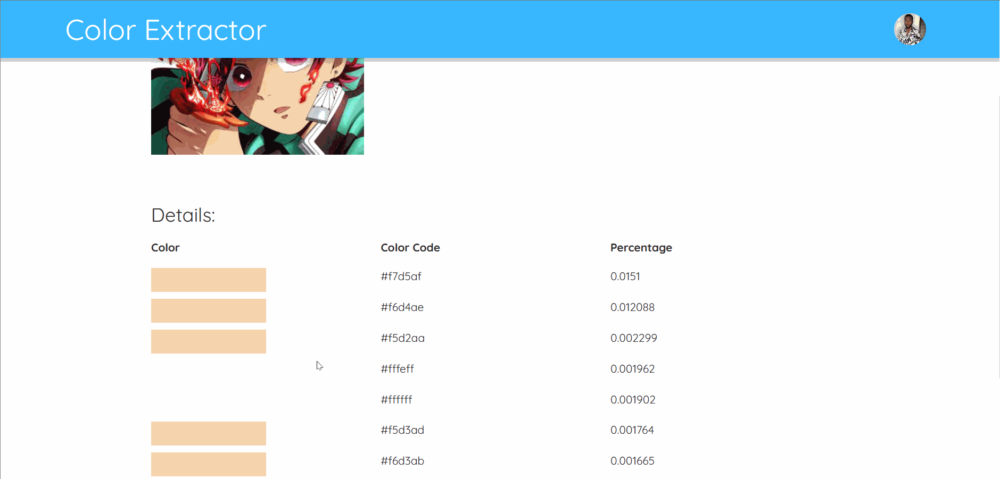
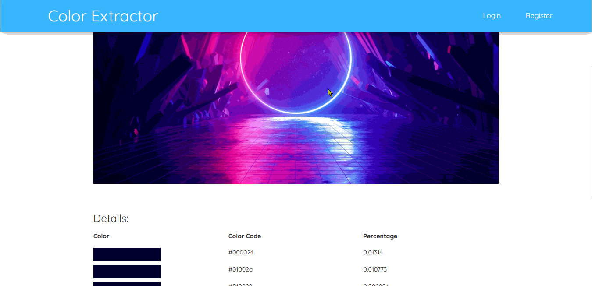
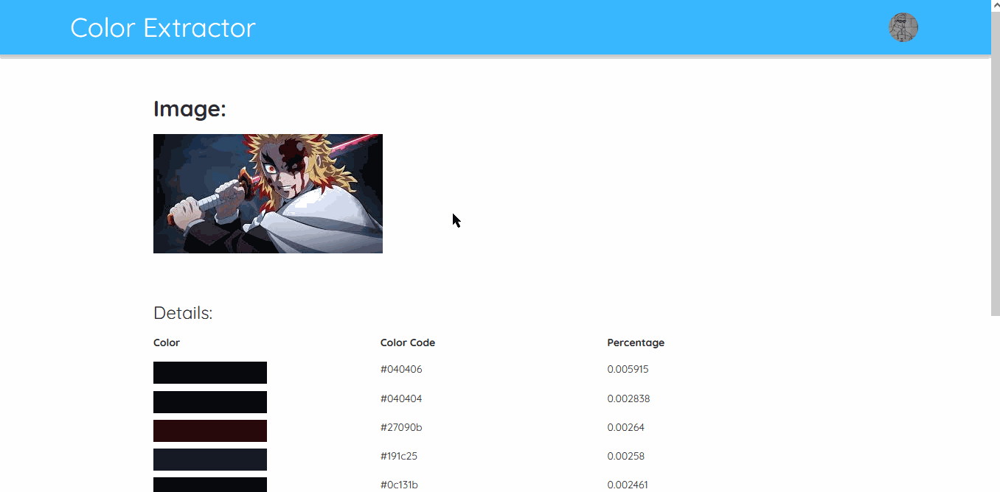

A web application that finds the most common colors in an uploaded image
effectively creating a color palette for you!

Try it out here [now](https://image-color-app.onrender.com).

**NOTE**: In the deployed demo, it may timeout for really large files because it is using a free web service on [render](https://render.com/).

# How it works:

# Table of Contents
- [Supported file formats](#supported-file-formats)
- [Features](#features)

## Supported file formats
This application supports images in the following file formats: 
- .jpeg 
- .jpg 
- .png 
- .webp 
- .gif
- .svg

## Features:
- Upload an image file.

- Extract the most common colors in an uploaded image.

- Copy the extracted color to the clipboard.

- Save your generated color palette.

- Go back in time to view previously saved colors.
